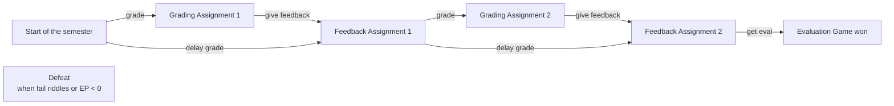

## 2. Submission Format

### 2.1. code
Split up your code into separate files (recall using import statements to import you code
as modules into the main script...) and submit all necessary files. A file structure with
subdirectories would be a good idea.
- Submit all of the code that is needed to run the game and no code that is not used in the final version of the game.
- All Python files must be provided with the following information in the header: Author, date, purpose of the file, sources if applicable.
- Each function/method (and class (we did not cover this in the course but you can use it if you wish)) must be documented with docstrings: What is the purpose of the function? What parameters does it take? What is the return value?
- Also make appropriate use of line comments. Complex data structures in particular must be documented. If you use (only short!) code snippets from external sources, quote the link in a comment directly before the line of code (but recall, we don’t encourage directly copying code from external sources).
- It’s a great exercise to expand your game with more commands, scenes and resources. However, to make grading easier, please only submit what is described in these guidelines.

### 2.2. Readme

- The README file is the entry point for anyone who wants to use your code. It is often formatted in markdown (.md). You can also create a simple text file though.
- A README file is mandatory. Your README file must clearly describe how the program works, which packages must be installed and how the program is started. You can find a template here: https://www.makeareadme.com/.

### 2.3. Report

- In addition, your submission must contain a short report (3-5 pages).
- It must contain an overview of your selected program structure / sequence as a flow chart or as pseudo code (or at least excerpt thereof).
- In the report, please comment on:
        - what difficulties you ran into while implementing the game and how you dealt with them,
        - what you learned while working on the project,
        - and what you might do differently the next time you work on a similar project.
        
## 3. Background: Text Adventures

Text Adventures (also known as interactive fiction) are games in which a story is controlled by textual descriptions of situations and text input from the player. In the most elementary form, a figure representing the player is moved through rooms by means of text input. Each new situation is then described by the system in text form. In each situation, there may be objects that can be picked up or manipulated in a certain way. There are small riddles to solve in order to progress with the story.
In other words, there is a certain game state here (where the character is located, which objects he/she has picked up, what the state of the available objects is [e.g. door open or locked]). Depending on the game state, different operations are possible (e.g. you can only go north in a room in which there is also something facing north).

## 4. task:

In this project you will implement a simple text adventure game. Make sure you follow all the rules correctly.

### 4.1. Content

Jane (or any name you prefer) will be the computational linguistics (CL) tutor next semester. She is keen to support students in their learning and will plan her schedule to allow sufficient time for grading and feedback sessions. Her goal is to complete grading all assignments and receive a good evaluation from her students at the end of the course. Unfortunately, she has no idea how much energy this will require and how many student requests will continue to come in. To cope with this responsibility, she will need her time off and sometimes also some chocolate.
The tutor must collect energy points, enter grades (for 2 assignments and 8 students per assignment) and successfully complete the two feedback sessions. Figure 2 shows a schematic representation of the game flow and Figure 3 gives an example of how to start the game.

### 4.2. Rules of the Game

- The tutor has a performance overview. At the start of the game, this contains 10 energy points (EP), 0 evaluation points (EVAL) and a list of students with blank grades.
- The names of the 8 students must be randomly chosen from the NLTK names corpus. For this, use the line from nltk.corpus import names and chose from names.words() at random using the random module.
- At any point in the game, the command inspect report must list the current content of the performance overview.
- The game starts at the beginning of the semester. First, the tutor must start grading. If she tries to go straight to the course evaluation, for example, a warning message is displayed that this option is invalid.
- During assignment grading, she will be asked to enter the grades for each student in turn. The grades she enters must be valid according to the German system (i.e. 1.0, 1.3...) and saved in the performance overview.
- Each grade she enters costs her 5 energy points (- 5EP). In addition, 4 types of events can occur: Students request an extension with a probability of 0.2 and -3EP; Students request a regrading with a probability of 0.2 and -2EP; Heavy debugging effort is required with a probability of 0.3 and -1EP; Students show appreciation for her help with a probability of 0.1 and +3EP. All EPs must be updated in the performance overview.
- There are two ways for her to gain new energy points: Resting, with +5EP (can be used several times in a row) or eating chocolate, with +10EP (can be used only once per grading session). She can do so at any time during grading.
- Once all grades have been entered for an assignment, she can proceed to the corresponding (1. or 2.) feedback session.
- The feedback session for Assignment 1 corresponds to the first riddle. If she succeeds, the next grading may begin, otherwise she loses the game. The course evaluation points corresponding to Riddle 1 are saved, but not yet entered in the performance overview for display.
- The feedback session for Assignment 2 corresponds to the second riddle. If she succeeds, the corresponding evaluation points are saved. She can then see the entire evaluation of the course and has won the game.
- At the end of the game, she can either view the performance overview, start another round of the game or exit the program. Don’t forget to reinitialize everything when a new game starts!
- At any time and state it must be possible to quit the game using the command exit.
- In either of the two grading + feedback rounds, the tutor can skip the grading part and go straight to the feedback session using the secret(!) code delay grade (this can be considered a shortcut in the game).
- At any point in the game, the tutor loses the game immediately if her energy point goes below zero.

### 4.3. Feedback Session 1: Guess the Topic!

In the first feedback session, students will ask three difficult questions and the tutor must try to understand their context. This will be implemented through a riddle. The quality of the tutor’s answers will affect her evaluation by the students.
In the riddle, a random topic is selected from the Reuters corpus available in NLTK and then a random sentence on that topic is presented to the tutor. The topics are the categories that can be accessed via reuters.categories(). The sentences for a topic are available at reuters.sents(categories=‘‘xxx’’).
For display to the tutor, you may only use sentences with less than 20 tokens. There are also two further preprocessing steps for which you must use RegEx: 
- Sentences with more than 3 numeric tokens should be excluded; 
- If the sentence contains the topic (category) name, it must be masked with the token [HIDDEN]. You can also perform further preprocessing, such as excluding sentences that contain too many special characters.
At the beginning, the tutor has 0 evaluation points. She then has 3 attempts per question to guess the topic (category name). If she succeeds on first try, she receives 40 evaluation points; on second try 30 evaluation points and on third try 20 evaluation points. This means that she can collect a maximum of 120 evaluation points if she guesses all three topics on the first attempt each.
The tutor can get a hint once for each topic. To do so, she must enter the command clarify.
The hint is one of the other sentences from the same topic.
If the tutor needs more time than one minute to enter a guess, she loses the whole game with 0 evaluation points. You can use the module time to implement this.

### 4.4. Feedback Session 2: Find the Code Phrase!

In the second feedback session, the tutor is asked to explain a difficult topic very clearly. Students will only understand her explanations (and therefore give a good evaluation) if they meet certain conditions. This is again implemented through a riddle. Here, the player’s task is simply to enter a valid code phrase without knowing the underlying rules. Valid code phrases are those that comply with the following definition: 
Definition: Let n be the number of tokens in a sentence/phrase `s = w1 w2 · · · wn` and `n` an even natural number. `s` is an accepted code phrase if and only if (iff) `∀i = 1, .., n2` the first character of the token `wi` is alphabetically less than or equal to the first character of the token `wn−i+1` and the last character of the token `wn−i+1` is alphabetically less than or equal to the last character of the token `wi`. If `n` is odd, `s` is an accepted code phrase iff the above holds `∀i = 1, .., (n−1)`. In addition, the first character of the middle token `w(n+1)/2` must be alphabetically less than or equal to its own last character.
Some examples:
- Examples of valid code phrases with even n: what is she yelling (because `w<y, i<s, and g<t, e<s`)
- Examples of invalid code phrases with even n: when is he leaving (because `w≮l and i≮h`)
- Examples of valid code phrases with uneven n: my dog is sleeping there (because `m<t, d<s and e<y, g=g and i<s`)
- Examples of invalid code phrases with uneven n: the cat was not flying (because `t≮f, g≮e and w≮s`)
- The tutor has 3 attempts to enter a valid code phrase. If she succeeds, she receives 80 evaluation points. Otherwise she loses the game.
- To achieve the full score, you must implement a recursive function that checks whether the entered code phrase is valid. The function must work for every number `n`.

### 4.5. Further Remarks

- In the respective scenes / games states, you must have the commands in Table 1 implemented. Please do not change or rename them.
- A textual description must be provided in each scene. Use your creativity to create entertaining descriptions.
- Each action may only be performed as a response to a command from the tutor.
- Decide for yourself what to do with invalid player inputs. However, a distinction must be made between invalid inputs in a certain state (which are possible in other states) and invalid inputs within the game (which are not valid in any state). A standard message is sufficient in each case, but you can be more creative if you want to.
- Output texts longer than 50 characters (e.g. lengthy scene descriptions) must be read from text files. Scene descriptions must not be hard-coded in the scripts!

---
Table 1: Commands that must be defined in your program in the corresponding scenes / game states.
```
Start                                           grade; inspect report; exit; delay grade
Grading 1 and 2                                 rest; eat chocolate; give feedback; inspect report; exit
Time off                                        rest; grade; inspect report; exit
Chocolate                                       grade; inspect report; exit
Feedback 1 (after Riddle 1)                     grade; inspect report; exit; delay grade
Feedback 2 (after Riddle 2)                     get eval; inspect report; exit
Evaluation                                      play again; inspect report; exit
Defeat                                          play again; inspect report; exit
```
---
Figure 2: Basic structure of the game. Yellow boxes contain riddles, green boxes represent end
states. Commands are highlighted in yellow, constraints on them in red.

---
Figure 3: Example of the game structure. You don’t have to use the same descriptions.
```
-- STARTING THE SEMESTER --

A new semester is beginning. How refreshing! You can barely wait to start helping your students learn the wonders of computational linguistics algorithms. You have 8 students in your list and two assignments to grade and discuss in class. Actually, the first batch of submissions have started to come! Do you want to begin grading immediately, take some free time to refuel your energy or check the list of participants?

> inspect report

                      - - - Semester Report - - -
                      Energy Level: 10             Evaluation: n/a
                      Grades:
                      Noel     -/-   Emile     -/-   Victoria -/-   Ophelia -/-
                      Miranda -/-    Giordano -/-    Cybelle  -/-   Pietro  -/-

> give feedback
You cannot give feedback before grading your pile of submissions!

> grade

                      - GRADING -
                      Good time to start grading now that you are still full of energy!

                      Please enter the grade for Noel. Or do you prefer to take some time off?
> 1,7

The grade for Noel has been logged. Your energy level has dropped 5 points.
Oh no, there comes the first student asking for an extension! Your energy level has dropped 3 points.

Please enter the grade for Miranda. Or do you prefer to take some time off?

> inspect report

                     - - - Semester Report - - -
                     Energy Level: 2             Evaluation: n/a
                     Grades:
                     Noel     1,7/-   Emile     -/-   Victoria -/-   Ophelia -/-
                     Miranda -/-      Giordano -/-    Cybelle  -/-   Pietro  -/-

> rest
```

---
Figure 4: Example of the first feedback session. The first sentence contains more than 3 numeric
tokens and actually should be filtered out in your RegEx-based preprocessing steps.
```
-- Feedback Session 1 --

The time has come for the first feedback session. The students have questions and are worried about their grades. They start to pose questions. Can you at least identify the topic of this comment?

[HIDDEN] rebates of up to 138.50 Ecus were requested for a total of 40,000 tonnes and at 139 Ecus for 85,000 tonnes.

> rice

Oops, wrong answer! Your reputation has just sunk slightly. But you still got two more chances. Maybe you need some clarification?

> clarify

It is too soon to assess the extent of the damage, but it is likely that northern West German crops are particularly at risk because of insufficient snow cover, it said.

> barley

Well done, the student was happy with your answer. But two more students have questions. Can you identify the topics of the next comment? 
```